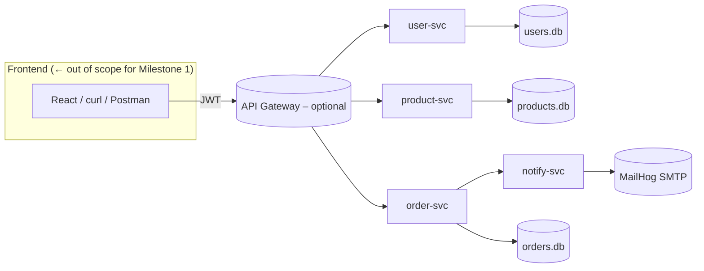
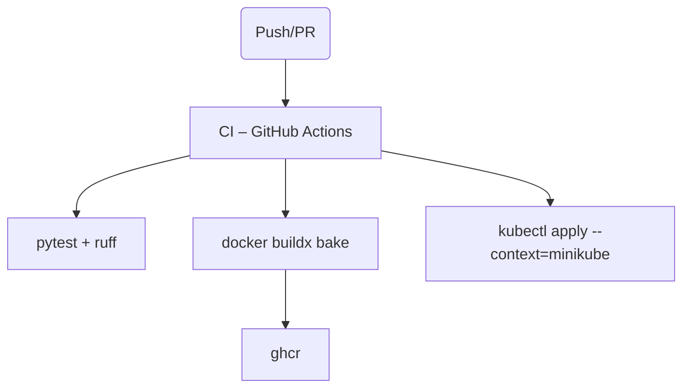

# QuickKart Architecture


---

## 1 Context & Goals

| Objective                                                   | Rationale                                        |
| ----------------------------------------------------------- | ------------------------------------------------ |
| Demonstrate *microservice decomposition* on a single laptop | Matches course rubric; keeps infra cost‑free     |
| Keep every container **tiny & transparent**                 | Fast grading, minimal RAM/CPU                    |
| Show clear upgrade path: Compose ➜ Kubernetes               | Bridges Part 1 to Part 2 deliverables            |
| Provide out‑of‑the‑box observability hooks                  | Prom/Grafana & `/healthz` meet Milestone 3 early |

### Non‑Goals

* Real payment processing
* High‑availability data layer (SQLite is “good enough” here)

---

## 2 Service Decomposition

| Service                | Purpose                    | DB                  | External Calls                    |
| ---------------------- | -------------------------- | ------------------- | --------------------------------- |
| **user‑svc** (8000)    | register / login / profile | `users.db` (SQLite) | —                                 |
| **product‑svc** (8001) | manage catalog items       | `products.db`       | —                                 |
| **order‑svc** (8002)   | convert cart → order       | `orders.db`         | user‑svc, product‑svc, notify‑svc |
| **notify‑svc** (8010)  | send e‑mail                | — (stateless)       | SMTP via MailHog                  |

Each DB is mounted on a Compose named volume; swapping to Postgres requires only an env‑var change via SQLAlchemy.

---

## 3 Component Diagram




---

## 4 Runtime Views

### 4.1 Docker Compose (Milestone 1)

* `quickkart_default` network for service discovery
* Named volumes: `user-data`, `product-data`, `order-data`
* Healthcheck endpoints: `/healthz`

#### Local Testing (PowerShell)

```powershell
# 0: Health Checks
Invoke-RestMethod http://localhost:8000/healthz
Invoke-RestMethod http://localhost:8001/healthz
Invoke-RestMethod http://localhost:8002/healthz
Invoke-RestMethod http://localhost:8010/healthz

# 1: Add Product
$body = @{ name="USB‑C cable"; description="1 m braided"; price=9.99 } | ConvertTo-Json
Invoke-RestMethod -Method Post -Uri http://localhost:8001/products -Headers @{"Content-Type"="application/json"} -Body $body

# 2: Register & Login
$creds = @{ email="alice@example.com"; password="secret" } | ConvertTo-Json
Invoke-RestMethod -Method Post -Uri http://localhost:8000/register -Headers @{"Content-Type"="application/json"} -Body $creds
$token = (Invoke-RestMethod -Method Post -Uri http://localhost:8000/login -Headers @{"Content-Type"="application/json"} -Body $creds).access_token

# 3: Place Order
$order = @{ item="USB‑C cable" } | ConvertTo-Json
Invoke-RestMethod -Method Post -Uri http://localhost:8002/orders -Headers @{"Authorization"="Bearer $token"; "Content-Type"="application/json"} -Body $order

# 4: List Orders
Invoke-RestMethod -Uri http://localhost:8002/orders -Headers @{ Authorization = "Bearer $token" }

# 5: MailHog UI
# Browse http://localhost:8025 to see notification emails
```

### 4.2 Kubernetes (Milestone 2 – upcoming)

| Resource          | Pattern                                          |
| ----------------- | ------------------------------------------------ |
| **Deployment**    | one per service, 1 replica → auto‑scale with HPA |
| **Service**       | ClusterIP (internals), NodePort (front‑door)     |
| **ConfigMap**     | env defaults (PORT, DB\_URL)                     |
| **Secret**        | JWT secret, SMTP creds                           |
| **HPA**           | product‑svc: CPU 70% target, min1/max5           |
| **NetworkPolicy** | deny‑all → allow same‑ns intra‑svc               |
| **RBAC**          | read‑only Prometheus ServiceAccount              |

Prometheus operator via `kube-prometheus-stack`; Grafana dashboard pre‑imported.

---

## 5 Data Management Strategy

* Database‑per‑service → autonomy (polyglot persistence)
* SQLite for local dev & CI; swap to Postgres by changing DB URL
* Alembic for migrations (even on SQLite)

---

## 6 Communication Patterns

1. **Synchronous REST** (JSON/HTTP) – easy debug
2. **Future**: RabbitMQ for async Order → Notification (stretch)

---

## 7 Observability Plan

| Concern | Implementation                          |
| ------- | --------------------------------------- |
| Metrics | FastAPI `/metrics` → Prometheus scrape  |
| Tracing | (stretch) OpenTelemetry → Grafana Tempo |
| Logs    | `uvicorn` STDOUT → Fluent Bit → Loki    |

---

## 8 Security Notes

* JWT (HS256): 15 min access, 7 day refresh
* Secrets via k8s `Secret` or `.env` (not committed)
* Dockerfiles drop root (`UID 1001`) & `--cap-drop ALL`

---

## 9 CI/CD Overview



> Local cluster creds in self‑hosted runner (course requirement).

---

## 10 Future Extensions

* API Gateway for unified auth & rate‑limit
* Switch SQLite → Postgres via env swap
* RabbitMQ event bus for async workflows
* Front‑end: React/SvelteKit consuming a gateway only
* Payment Service stub (Stripe test keys)

---

*End of architecture.md*
