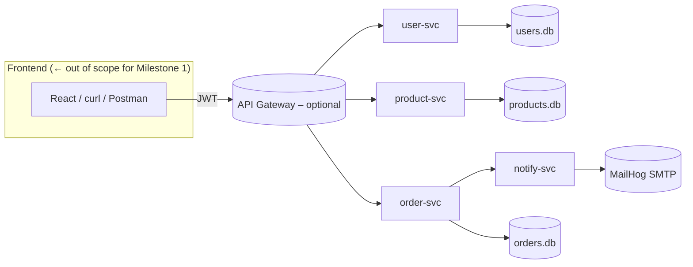
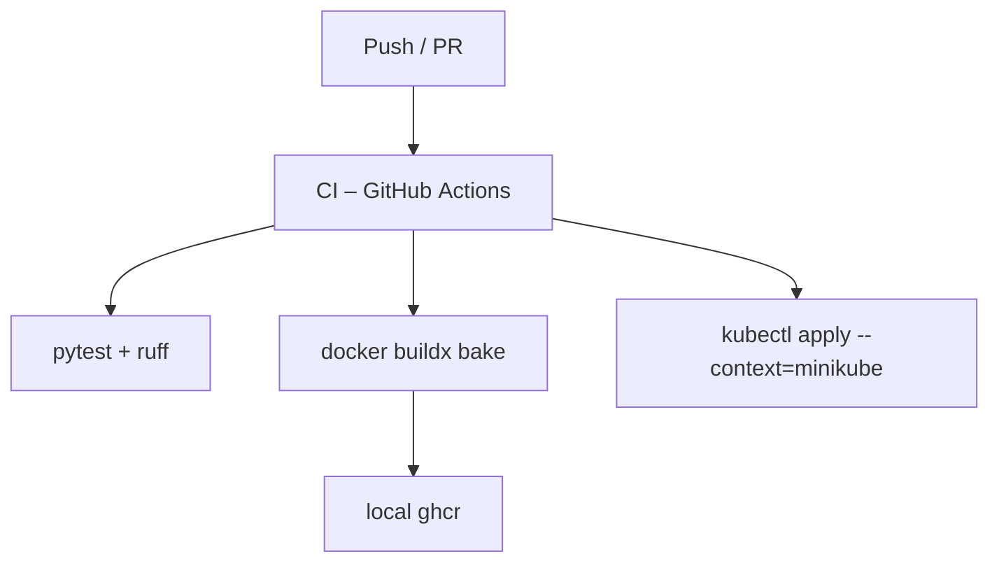

# QuickKart Architecture

> **Version 0.1 – covers Milestone 1 (Docker Compose) and forward‑looking notes for Milestones 2‑3.**
> **Version 0.1.1 – Milestone 1 delivered (Docker Compose); Milestones 2-3 notes unchanged**

---

## 1 Context & Goals

| Objective                                                   | Rationale                                        |
| ----------------------------------------------------------- | ------------------------------------------------ |
| Demonstrate *microservice decomposition* on a single laptop | Matches course rubric; keeps infra cost‑free     |
| Keep every container **tiny & transparent**                 | Fast grading, minimal RAM/CPU                    |
| Show clear upgrade path: Compose ➜ Kubernetes               | Bridges Part 1 to Part 2 deliverables            |
| Provide out‑of‑the‑box observability hooks                  | Prom/Grafana & `/healthz` meet Milestone 3 early |

### Non‑Goals

* Real payment processing
* High‑availability data layer (SQLite is “good enough” here)

---

## 2 Service Decomposition

| Service                | Purpose                    | DB                  | External Calls                    |
| ---------------------- | -------------------------- | ------------------- | --------------------------------- |
| **user‑svc** (8000)    | register / login / profile | `users.db` (SQLite) | —                                 |
| **product‑svc** (8001) | manage catalog items       | `products.db`       | —                                 |
| **order‑svc** (8002)   | convert cart ➜ order       | `orders.db`         | user‑svc, product‑svc, notify‑svc |
| **notify‑svc** (8010)  | send e‑mail                | — (stateless)       | SMTP via MailHog                  |

Each DB lives on a Compose **named volume** or a k8s `emptyDir` for demo; upgrading to Postgres is one env‑var swap thanks to SQLAlchemy.

---

## 3 Component Diagram



*Dashed box shows optional FastAPI “gateway” that can enforce auth/rate‑limit later; we skip it in Part 1 for simplicity.*

---

## 4 Runtime Views

### 4.1 Docker Compose (Milestone 1)

* Bridge network `quickkart_default` – services discover each other by container name.
* Volumes `user‑data`, `product‑data`, `order‑data` persist SQLite files.
* Healthcheck (✔) – `curl -f http://localhost:PORT/healthz`.

#### Local Testing (PowerShell Example)

```powershell
# Check health endpoints
curl http://localhost:8000/healthz
curl http://localhost:8002/healthz

# Register a user
curl -Method Post -ContentType 'application/json' `
     -Body '{"email":"alice@example.com","password":"secret"}' `
     http://localhost:8000/register

# Log in and capture JWT
$token = (Invoke-RestMethod -Method Post -ContentType 'application/json' `
          -Body '{"email":"alice@example.com","password":"secret"}' `
          -Uri  http://localhost:8000/login).access_token

# Place an order (validates JWT with user-svc)
Invoke-RestMethod -Method Post -ContentType 'application/json' `
     -Headers @{ Authorization = "Bearer $token" } `
     -Body '{"item":"USB-C cable"}' `
     -Uri  http://localhost:8002/orders

# List all orders for current user
Invoke-RestMethod -Headers @{ Authorization = "Bearer $token" } `
     http://localhost:8002/orders
```

### 4.2 Kubernetes (Milestone 2)

| Resource          | Pattern                                          |
| ----------------- | ------------------------------------------------ |
| **Deployment**    | one per service, 1 replica → auto‑scale with HPA |
| **Service**       | ClusterIP (internals), NodePort (front‑door)     |
| **ConfigMap**     | env defaults (PORT, DB\_URL)                     |
| **Secret**        | JWT secret, SMTP creds                           |
| **HPA**           | product‑svc: CPU 70% target, min1/max5           |
| **NetworkPolicy** | deny‑all → allow same‑ns intra‑svc               |
| **RBAC**          | read‑only Prometheus ServiceAccount              |

Prometheus Operator is installed via `kube-prometheus-stack` manifest; Grafana dashboard JSON is pre‑imported.

---

## 5 Data Management Strategy

* **Database‑per‑service** maximises autonomy → aligns with polyglot persistence principle.
* Local dev uses SQLite to avoid Dockerising Postgres; CI runs the same.
* Migrations handled by Alembic (generates `.sql` even for SQLite for consistency).

---

## 6 Communication Patterns

1. **Synchronous REST** (JSON/HTTP) — simple, easiest to debug.
2. **Eventual upgrade path**: If time permits, Order → Notification could be made asynchronous via RabbitMQ; for now an HTTP POST suffices.

---

## 7 Observability Plan

| Concern     | Implementation                                         |
| ----------- | ------------------------------------------------------ |
| **Metrics** | FastAPI `/metrics` ➜ Prometheus scrape                 |
| **Tracing** | (stretch) OpenTelemetry SDK exporting to Grafana Tempo |
| **Logs**    | `uvicorn` STDOUT → Fluent Bit → Loki                   |

---

## 8 Security Notes

* **JWT** (HS256) with 15‑min access, 7‑day refresh.
* Secrets mounted from k8s `Secret` or `.env` in Compose; never committed.
* Dockerfiles use non‑root UID 1001 and `--cap-drop ALL`.

---

## 9 CI/CD Overview



> Local cluster credentials are configured in a GitHub Actions self‑hosted runner (course requirement allows local).

---

## 10 Future Extensions

* API Gateway to unify endpoints & handle rate limiting.
* Switch SQLite ➜ Postgres with minimal env change.
* RabbitMQ event bus for async order fulfillment.
* Front‑end: lightweight React / SvelteKit consuming gateway only.
* Payment Service stub integrating Stripe test keys.

---

*End of architecture.md*
